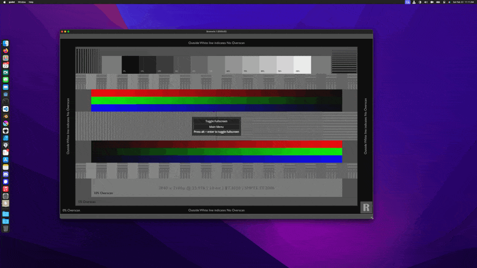

# 🛠️ GameTools

[![Chickensoft Badge][chickensoft-badge]][chickensoft-website] [![Discord][discord-badge]][discord] [![Read the docs][read-the-docs-badge]][docs] ![line coverage][line-coverage] ![branch coverage][branch-coverage]

A collection of tools for accelerating Godot + C# game development.

---

<p align="center">

</p>

## 📦 Installation

```sh
# Install this template
dotnet add package  Chickensoft.GameTools --prerelease
```

## ⏳ Multithreaded Loading

Godot provides a wonderful mechanism called [ResourceLoader] that can load engine resources in the background, but leveraging it correctly to load more than one thing at once is [surprisingly complicated](./Chickensoft.GameTools/src/Loader.cs).

You can leverage the `Loader` class provided by GameTools to simplify loading:

```csharp
using Godot;
using Chickensoft.GameTools;

public partial class MyNode : Node {

  public Loader Loader { get; set; } = default!;

  public Mesh MyMesh { get; set; } = default!;
  public PackedScene MyScene { get; set; } = default!;

  public override void _Ready() {
    Loader = new();

    // Add a job for everything you want to load. The callback will be
    // invoked with your loaded resource, allowing you to hang onto it.
    Loader.AddJob<Mesh>(
      "res://my_mesh.tscn", (resource) => MyMesh = resource
    );
    Loader.AddJob<PackedScene>(
      "res://my_scene.tscn", (resource) => MyScene = resource
    );

    // Subscribe to events to track progress and completion.
    Loader.Progress += OnLoaderProgress;

    // There are other loading events you can subscribe to, if needed:
    // Loader.Started += () => GD.Print("Loader started!");
    // Loader.Completed += () => GD.Print("Loader completed!");

    // Start loading everything.
    Loader.Load();
  }

  public override void _Process(double delta) {
    // Call Update every frame to track progress and ensure events are invoked.
    if (!Loader.IsCompleted) {
      Loader.Update();
    }
  }

  public override void _ExitTree() {
    Loader.Progress -= OnLoaderProgress;
  }
  public void OnLoaderProgress(float progress) {
    GD.Print($"Total loading percent: {progress}");
  }
}
```

> [!TIP]
> To facilitate simple UI construction, the loader guarantees that you will receive progress updates for 0.0 and 1.0. The progress amount is the progress of all jobs as a percentage between 0 and 1.

## 🏝️ Godot Feature Tags & Application Environment

Godot provides [Feature Tags] which allow you to examine the runtime environment of the application. The game tools provides a way to easily access these tags through a strongly-typed interface for C#. It also enables the feature tags to be overridden for testing purposes.

```csharp
if (Features.OperatingSystem is OSFamily.macOS or OSFamily.Linux) {
  GD.Print("Unix-based system");
}

// Whenever you need to test a specific environment, you can override the
// feature tags to simulate that environment.
Features.FakeOperatingSystem(OSFamily.Linux);

// Reset overridden features back to the system's actual environment.
Features.Reset();
```

| Feature             | C# Enum Type         | Code                          |
|---------------------|----------------------|-------------------------------|
| Operating System    | `OSFamily`           | `Features.OperatingSystem`    |
| Platform            | `Platform`           | `Features.Platform`           |
| Interactivity Mode  | `InteractivityMode`  | `Features.InteractivityMode`  |
| Build Type          | `BuildType`          | `Features.BuildType`          |
| Tool Environment    | `ToolEnvironment`    | `Features.ToolEnvironment`    |
| Precision           | `Precision`          | `Features.Precision`          |
| Bit Length          | `BitLength`          | `Features.BitLength`          |
| Architecture        | `Architecture`       | `Features.Architecture`       |
| Texture Compression | `TextureCompression` | `Features.TextureCompression` |

For all possible values, check each enum type.

## 🖥️ Display Scaling & DPI Awareness

GameTools can help you manage display scaling on desktop platforms by automatically guessing or computing the correct scale factor for the game window's screen. On macOS and Windows, it can determine the exact user-defined scale factor by leveraging [Chickensoft.Platform] to invoke the relevant system API's natively.

Check out the [demo project] which lets you select between both scaling behaviors and toggle fullscreen mode.

## High-Level Scaling Behaviors

Two high-level scaling behaviors are provided by GameTools. Both work well when windowed or full-screen and automatically correct for the scale factor of the screen that the window is on.

### ✅ Proportional UI Scaling

Scales the UI (and your game) down as the window shrinks. Everything remains the same size relative to each other, enabling you to create games for a specific resolution or highly custom visual style.



```csharp
var info = GetWindow().LookGood(
  WindowScaleBehavior.UIProportional,
  BaseResolution,
  isFullscreen: false // or true
);
```

### ✅ Fixed UI Scaling

Leaves the UI at a fixed size. You can easily configure your game to clip behind it or scale to fit the window using a [SubViewport]. For the demo, we've opted to configure the game to scale to fit the window while the UI remains unchanged.


```csharp
var info = GetWindow().LookGood(
  WindowScaleBehavior.UIFixed,
  BaseResolution,
  isFullscreen: true // or false
);
```

> [!TIP]
> For more on display scaling, check out Chickensoft's blog article titled [Display Scaling in Godot 4][display-scaling].

## Manual Scaling

You can use the information provided by GameTools in your own scaling computations.

```csharp
using Chickensoft.GameTools;

public override void _Ready() {
  var window = GetWindow();

    var window = GetWindow();
    var scaleInfo = window.GetWindowScaleInfo(Display.UHD4k);
    var sizeInfo = Display.GetWindowSizeInfo(scaleInfo.LogicalResolution);

    window.ContentScaleFactor = scaleInfo.ContentScaleFactor;
    // There are many other properties on scaleInfo, such as
    // SystemScale, LogicalResolution, NativeResolution, DisplayScale, etc.

    // sizeInfo has a recommended size for the window and a recommended min and
    // max size for the window. In case you can't be bothered to do all that.
}
```

---

🐣 Package generated from a 🐤 Chickensoft Template — <https://chickensoft.games>

[chickensoft-badge]: https://chickensoft.games/img/badges/chickensoft_badge.svg
[chickensoft-website]: https://chickensoft.games
[discord-badge]: https://chickensoft.games/img/badges/discord_badge.svg
[discord]: https://discord.gg/gSjaPgMmYW
[read-the-docs-badge]: https://chickensoft.games/img/badges/read_the_docs_badge.svg
[docs]: https://chickensoft.games/docsickensoft%20Discord-%237289DA.svg?style=flat&logo=discord&logoColor=white
[line-coverage]: Chickensoft.GameTools.Tests/badges/line_coverage.svg
[branch-coverage]: Chickensoft.GameTools.Tests/badges/branch_coverage.svg

[ResourceLoader]: https://docs.godotengine.org/en/stable/classes/class_resourceloader.html
[Chickensoft.Platform]: https://github.com/chickensoft-games/Platform
[Feature Tags]: https://docs.godotengine.org/en/stable/tutorials/export/feature_tags.html
[SubViewport]: https://docs.godotengine.org/en/stable/classes/class_subviewport.html
[demo project]: /Chickensoft.GameTools.Demo/src/
[display-scaling]: https://chickensoft.games/blog/display-scaling
